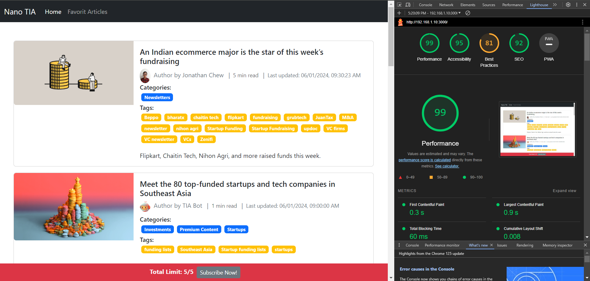
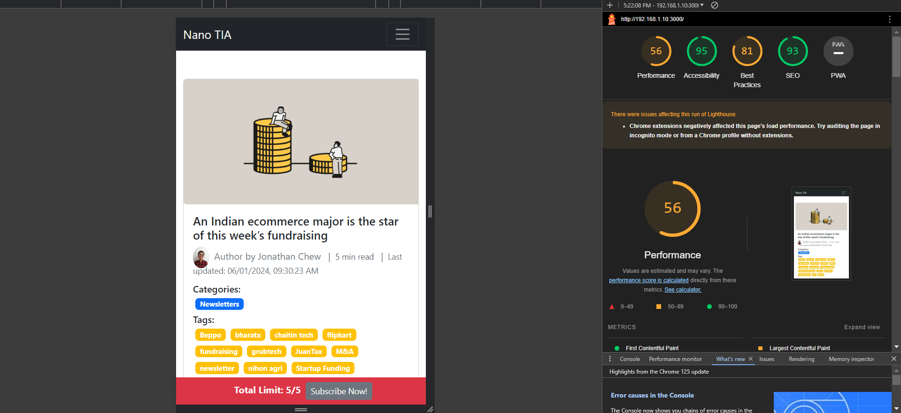
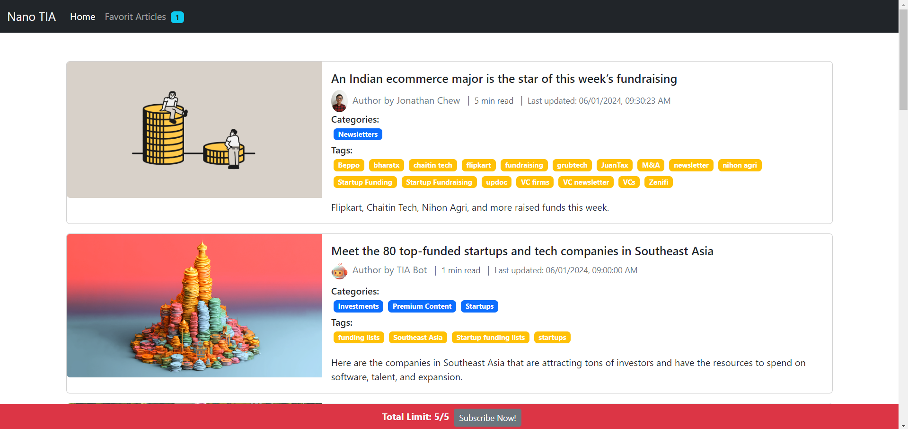
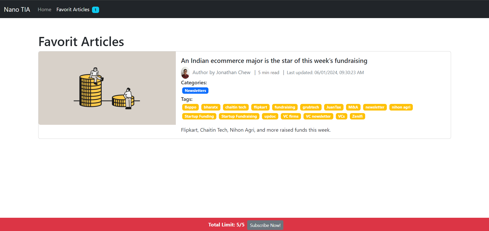
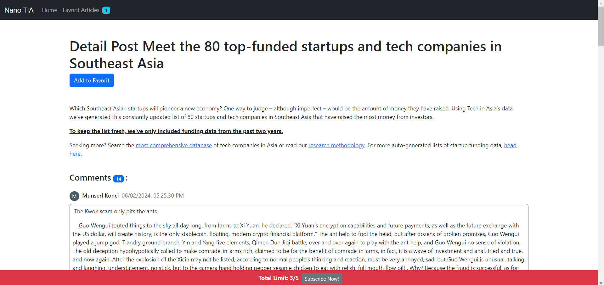
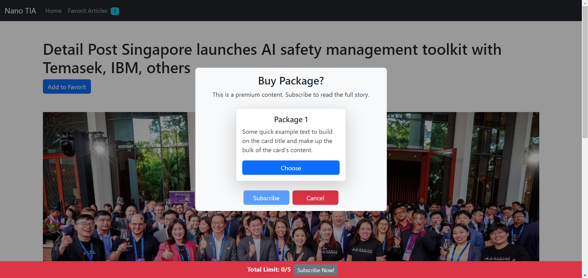

## Getting Started

This project was bootstrapped with [Create React App](https://github.com/facebook/create-react-app).

1. First, clone this project
2. Second, run command **npm install**
3. Last, run the project with command **npm run start**
4. Run production, **npm run build** then **serve -s build**

## APIs

* https://www.techinasia.com/wp-json/techinasia/2.0/posts

## Description

The project for showing articles about technology. Here, I build a several feature such as:

* Create shared components
* Create custom hooks for navigation
* Create infinite scroll on the homepage for articles list and detail article
* Lazy load images and component
* Add mark/favorit for the article that you like it
* State management using react-redux.
* More ...

## Libraries

There are several libraries in this project:

1. **bootstrap**: for styling the User Interface
2. **react-helmet-async**: for SEO optimization such as title, description, image and more.
3. **@reduxjs/toolkit**: for state management and also hit API
4. **react-lazy-load-image-component**: for lazy load images and components
5. **react-router-dom**: for configuration routing on this project

## Web Vital Score

* Website
* Mobile

  

## Structure Project

- [package\-lock.json](package-lock.json)
- [package.json](package.json)
- __public__

  - [default\-image.png](public/default-image.png)
  - [favicon.ico](public/favicon.ico)
  - [index.html](public/index.html)
  - [logo192.png](public/logo192.png)
  - [logo512.png](public/logo512.png)
  - [manifest.json](public/manifest.json)
  - [robots.txt](public/robots.txt)
- __src__

  - [App.js](src/App.js)
  - [App.test.js](src/App.test.js)
  - __common__
    - [constant.js](src/common/constant.js)
    - [index.js](src/common/index.js)
    - [path.js](src/common/path.js)
  - __components__
    - [CardList.js](src/components/CardList.js)
    - [Comment.js](src/components/Comment.js)
    - [NavLink.js](src/components/NavLink.js)
    - [Navbar.js](src/components/Navbar.js)
    - [PayWall.js](src/components/PayWall.js)
    - [PayWallContent.js](src/components/PayWallContent.js)
    - [Seo.js](src/components/Seo.js)
    - [TotalReadLimit.js](src/components/TotalReadLimit.js)
    - [WrapInfo.js](src/components/WrapInfo.js)
    - [index.js](src/components/index.js)
  - __hooks__
    - [index.js](src/hooks/index.js)
    - [useNavigateWithTransitions.js](src/hooks/useNavigateWithTransitions.js)
  - [index.css](src/index.css)
  - [index.js](src/index.js)
  - [logo.svg](src/logo.svg)
  - __mocks__
    - [data.json](src/mocks/data.json)
  - __pages__
    - [DetailPost.js](src/pages/DetailPost.js)
    - [DetailPost.module.css](src/pages/DetailPost.module.css)
    - [Error.js](src/pages/Error.js)
    - [FavoritArticlesPage.js](src/pages/FavoritArticlesPage.js)
    - [Home.js](src/pages/Home.js)
  - [reportWebVitals.js](src/reportWebVitals.js)
  - __routes__
    - [index.js](src/routes/index.js)
    - [routes.js](src/routes/routes.js)
  - __services__
    - [list\-articles.js](src/services/list-articles.js)
  - [setupTests.js](src/setupTests.js)
  - __store__
    - __features__
      - __favorit\-articles__
        - [favoritArticlesSlice.js](src/store/features/favorit-articles/favoritArticlesSlice.js)
      - __read\-limit__
        - [readLimitSlice.js](src/store/features/read-limit/readLimitSlice.js)
    - [store.js](src/store/store.js)
  - __utils__
    - [convertDate.js](src/utils/convertDate.js)
    - [index.js](src/utils/index.js)
    - [removeDuplicate.js](src/utils/removeDuplicate.js)

## Showcase

* Home

  
* Favorit

  
* Detail + Comments

  
* Paywall

  
